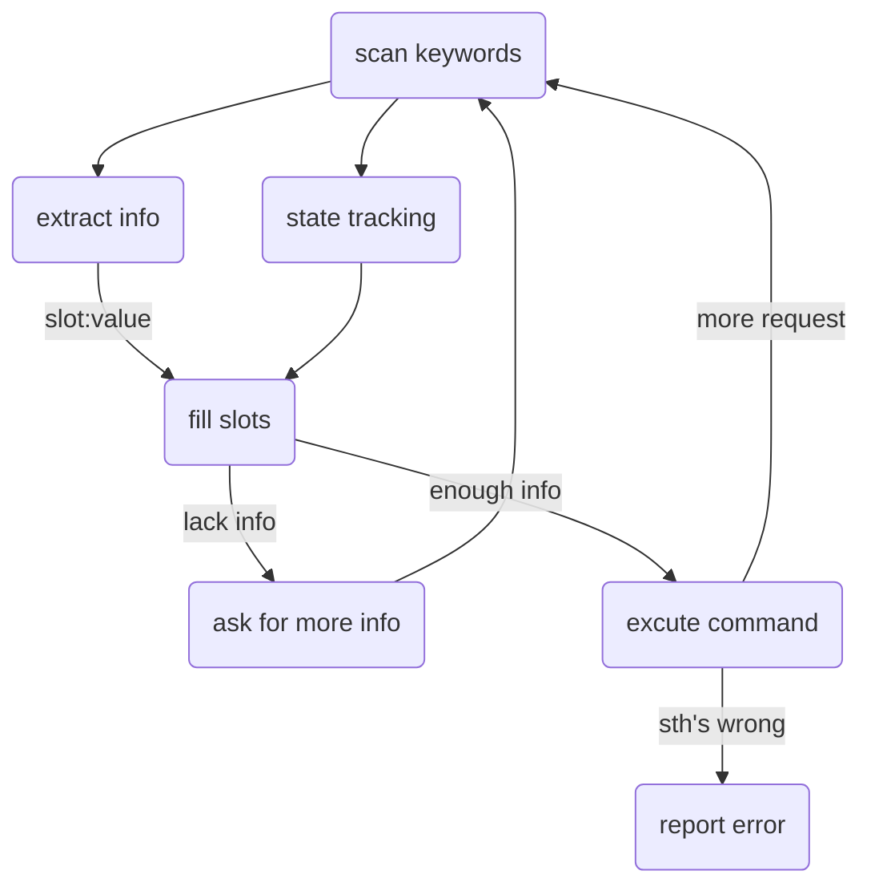
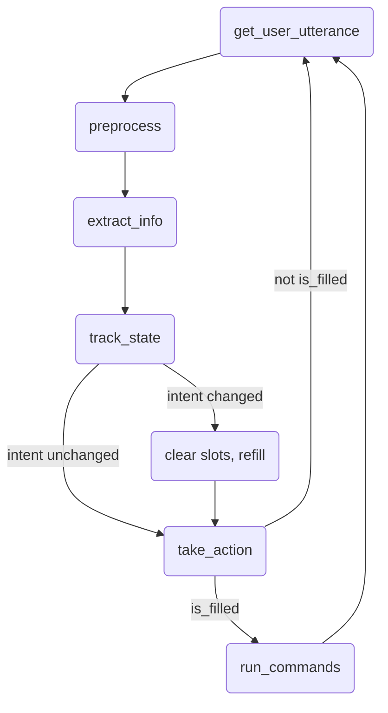
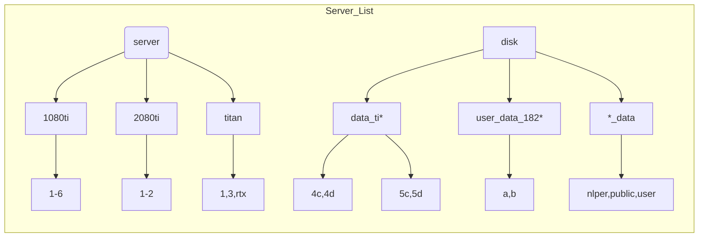
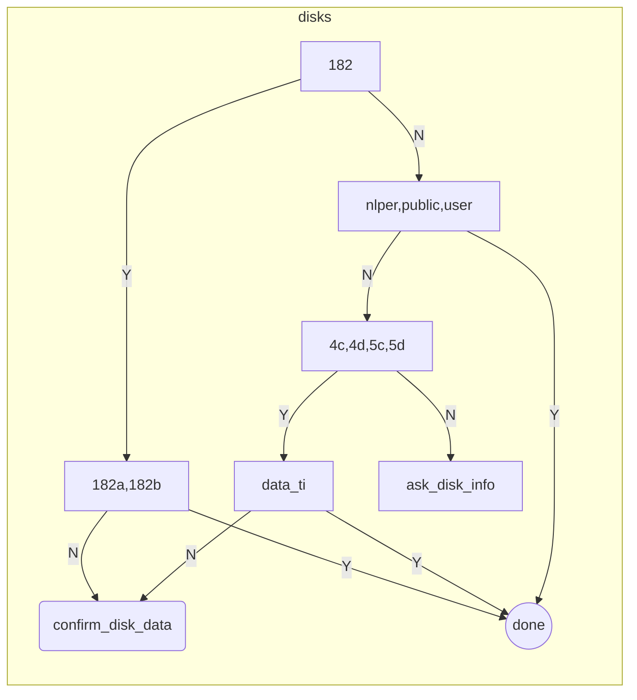
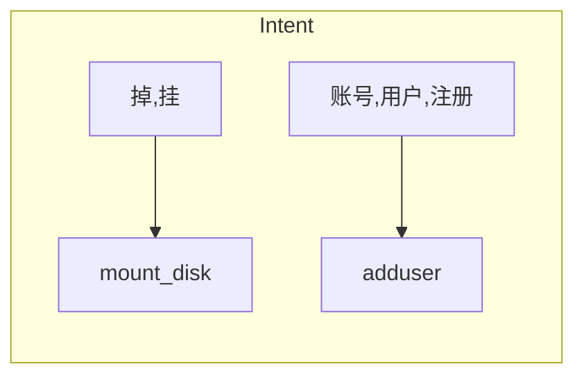

# SVRobot
> @author: Yuanhang Tang (汤远航)
> 
> @e-mail: yuanhangtangle@gmail.com
> 
> @description: a QA robot that provides convenience for issues related to the servers in NLP group
--------------------------

> @datetime: 2021/04/09
## Pipeline

## Project Structure
- SVRobot
  - NLU
  - SlotValues: 
    - Server
    - user

## Work Flow

## Todo
- Design a NLU strategy and finish `NLU.py`
- Refine `cvRobot.CVRobot.track_state` to use overlapping information
- Design commands to run in the shell
- Add more template response to make it more diverse
-------------------------------

> @datetime: 2021/04/11

## Possible Requests
  - one request for a single utterance: to mount exactly one disk, to add exactly one user
  - several requests for a single utterance: 
    - one intent for sreveral actions: to mount several disks for different servers, to add several users
    - several intents: to mount a disk and also add a user
    - combination of the above

## Todo
- Finish `NLU.py`
- Refine `cvRobot.CVRobot.track_state` to use overlapping information
- Design commands to run in the shell
- Add more template response to make it more diverse
- Replace priority of each intents with probability
- Add a server profile and modify extracter