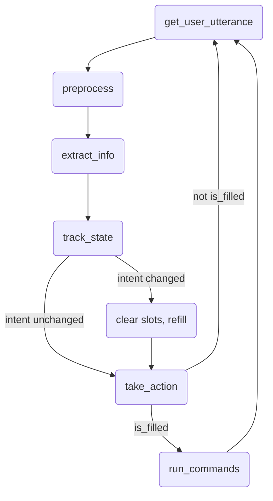
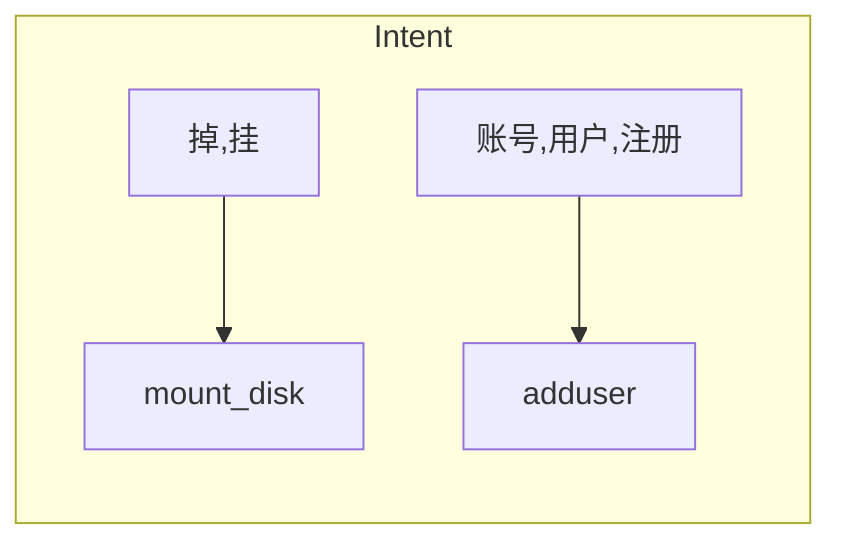
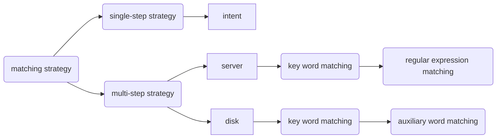
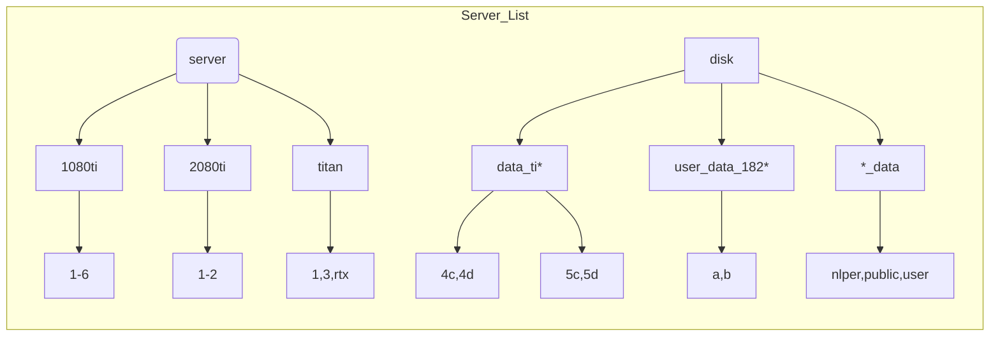
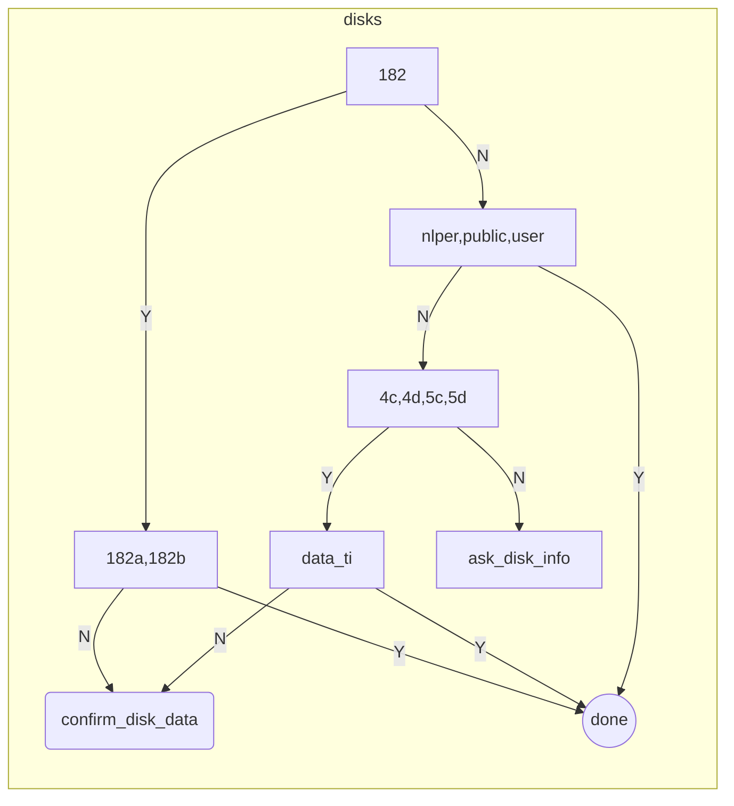

# SVRobot
> @author: Yuanhang Tang (汤远航)
> 
> @e-mail: yuanhangtangle@gmail.com
> 
> @description: a QA robot that provides convenience for issues related to the servers in NLP group. It was
> NOT finally put into use as we decided to deal with the troubles in a much more direct manner. 
--------------------------

## Project Structure
- __test__.json
- SVRobot
- NLU
  - profiles/intents.josn
  - profiles/disks.json
  - profiles/servers.json
- SlotValues
  - Server
  - User
  - Disk
- utils

## Work Flow

## Intents: Simple Keyword detection

## Key Match Strategy:
- server: key word matching + regular expression matching 
- disk: key word matching + auxiliary word match
- intent: key word matching
  

**Multi-step matching strategy** can be viewed as breaking down a pattern into low-level patterns and match those low-level patterns step-by-step. The confidence on a pattern is increased if some of the low-level patterns are matched, and what patterns will be used depends on the previous matching results. Possible patterns are decreased during this process. This process can be naturally modeled by a DAG. 

## Server: Multi-step matching

## Disk: Multi-step matching
