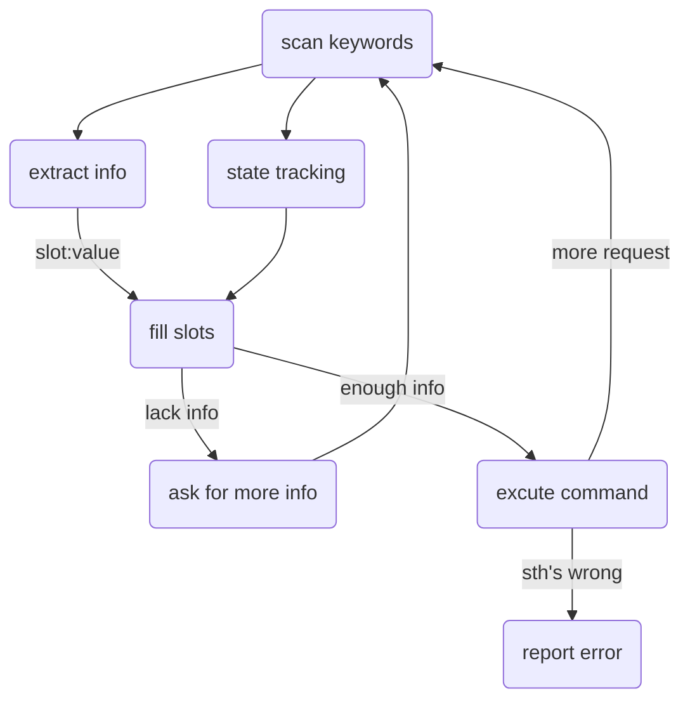
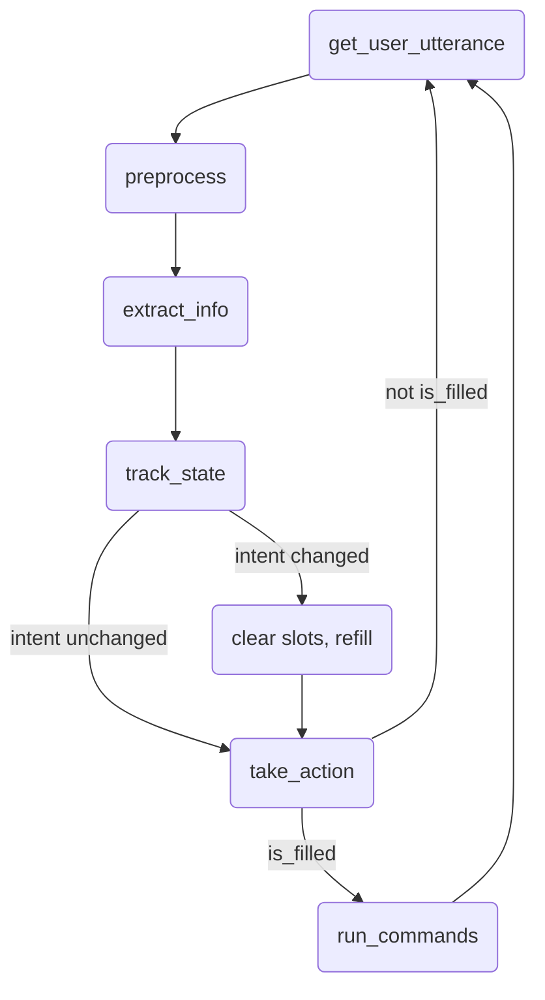

# SVRobot
> @author: Yuanhang Tang (汤远航)
> 
> @e-mail: yuanhangtangle@gmail.com
> 
> @description: a QA robot that provides convenience for issues related to the servers in NLP group

## Pipeline

## Project Structure
- SVRobot
  - NLU
  - SlotValues: 
    - Server
    - user

## Work Flow

## Todo
> @datetime: 2021/04/09
- Design a NLU strategy and finish `NLU.py`
- Refine `cvRobot.CVRobot.track_state` to use overlapping information
- Design commands to run in the shell
- Add more template response to make it more diverse