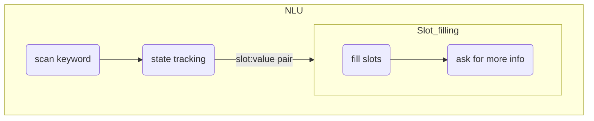

```mermaid
graph TB
    subgraph NLU
    kw(scan keyword) --> st(state tracking)
    st -->|slot:value pair| Slot_filling
    end

    subgraph Slot_filling
    sf(fill slots) --> ms(ask for more info)
    end
    
```